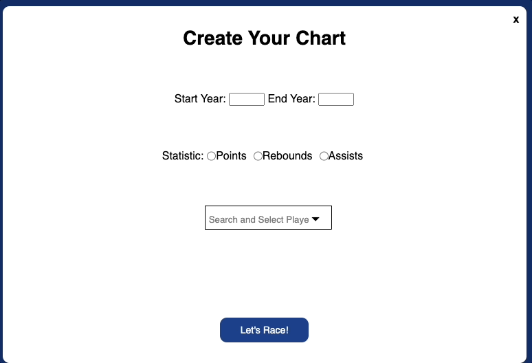
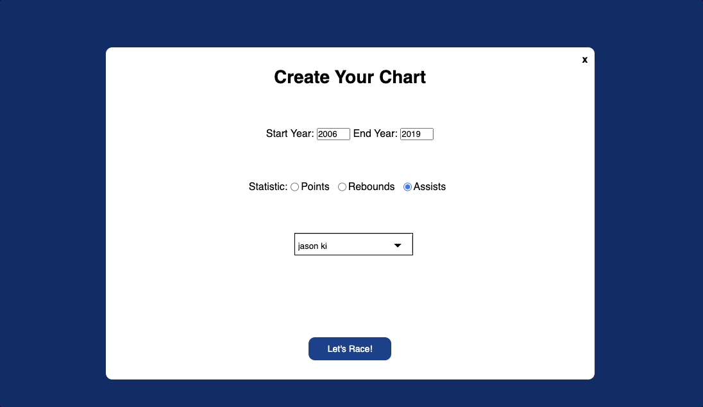

# NBA-Bar-Chart-Races

## Background

Welcome to my NBA Bar Chart Races application! This app is designed for anyone with an interest in fun data visualizations (though NBA fans might get the most out of it!)

First off, a bar chart race -- what is it? A bar chart race is a dynamic take on your traditional bar chart that demonstrates data changing over time by animating the chart. The project leverages data from https://www.basketball-reference.com/ and specifically looks at the 21st century history of the NBA, allowing you to see how the league's players have fared in key statistical categories over the past 20+ years.

## Functionality

In NBA Bar Chart Races, users can:

    1. Select the statistic that they want to view the progression of (Points, Rebounds or Assists)
    2. Set the year range.
    3. Customize the players included in the chart. Select up to 15 players to compare against each other.
    4. Hover over specific bars to see more information about the player.

In addition, this project includes:

    * An instruction pop-up window on the site
    * Search and multiselect functionality for selecting players
    * Ability to reset and create a new chart immediately following completion of the prior chart's progression

## Wireframe

https://wireframe.cc/23piDp

## Technologies, Libraries & APIs

This project used the ChartJS library to render the basic outline of the chart.

Additionally, the data is from customized CSVs pulled from https://www.basketball-reference.com/

## Usage Overview

Upon clicking 'New Chart', users can customize the details of their specific visualization -- year range, target statistic, and players included.

Once you've customized your chart, click 'Let's Race' and see how your data develops!

## Future Bonus Features

    - Image display of the player at the top of the list once the progression finishes

